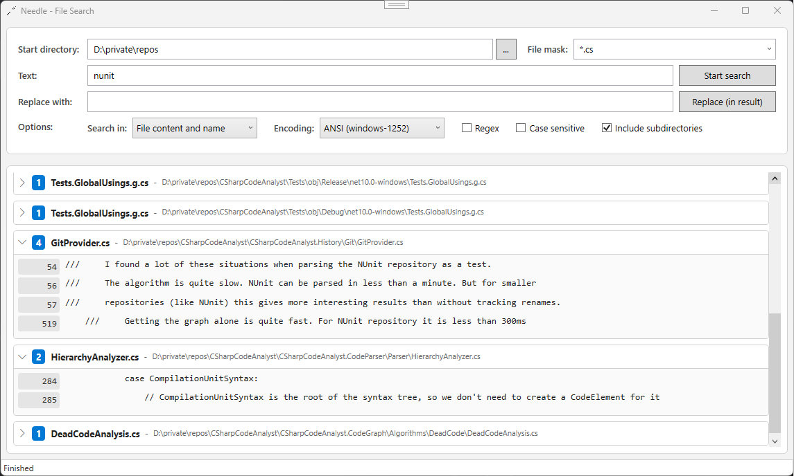

# Needle

A simple and fast text search and replace tool for Windows, with a command line tool for searching on Windows and Linux.

## Prerequisites

- .NET 10 Runtime ([download](https://dotnet.microsoft.com/download/dotnet/10.0))
- The Linux build of the command line tool is self-contained and needs no runtime.



## Searching

| Option | Description |
|---|---|
| Start directory | Directory to search in. |
| File mask | One or more masks separated by `;`, `,` or `\|`, e.g. `*.cs;*.xaml`. The last 10 masks are kept in the drop-down. |
| Text | Plain text, or a .NET regular expression if *Regex* is checked. The search works line by line, so a match cannot span several lines. |
| Replace with | Replacement text, see [Replacing](#replacing). |
| Search in | *File content*, *File name* or both. |
| Encoding | Encoding for files without byte order mark (BOM), see [Encoding](#encoding). |
| Case sensitive | Applies to plain text and regular expressions. |
| Include subdirectories | Searches the whole directory tree. |

All files matching the file mask are searched, including hidden, system and binary files. The `.git` and `.vs` directories are skipped. Symbolic links and junctions to directories are not followed, they could form endless loops. Files and directories that cannot be read, like locked files, files without access or broken ZIP archives, are skipped and counted in the status bar.

Click a file to expand its matches. The match is highlighted in its line. A line with several matches is listed once per match, each row highlights its own match. Long lines are cut around the match. The context menu opens a file in Explorer or a match in Notepad++.

### File Names

A match in a file name is listed as the first row of the file's matches, marked with a blue **Name** badge instead of a line number. When searching in both content and file name, each file is listed once with all its matches.

### ZIP Archives

You can search within ZIP files by including `*.zip` in your file mask. The file masks are applied to each file within the archive, allowing you to search large archives without prior extraction.

Nested archives are ignored. Matches inside archives cannot be replaced.

### Encoding

Files with a BOM are read with the encoding of the BOM (UTF-8, UTF-16 LE/BE, UTF-32 LE/BE).

Files without BOM are read with the encoding selected in *Encoding*: UTF-8 (default) or the ANSI code page of the system (e.g. Windows-1252). The encoding of such files cannot be detected reliably, so you have to choose.

The search tolerates a wrong encoding: ASCII text is still found, only non-ASCII characters may not match.

Binary files are searched like text files. Set *Encoding* to ANSI to find ASCII strings reliably, because every byte is one character then. Strings stored as UTF-16 (common in Windows and .NET binaries) are not found.

## Replacing

*Replace* replaces the selected matches in the current result with the text in *Replace with*. With *Regex*, the replacement can refer to capture groups, e.g. `$1`.

All matches are selected after a search. Use the check boxes to exclude single matches, or a whole file with the check box in its header.

Replacing never guesses, it refuses files instead of risking to corrupt them. A file is not modified and an error is shown if

- the file was modified after the search, so the found positions are no longer valid,
- the file is not valid in its encoding (e.g. an ANSI file searched as UTF-8),
- the replacement text contains characters that cannot be stored in the file's encoding (e.g. `→` in Windows-1252).

Only the matched text is modified. All other bytes stay unchanged, including the BOM, the line endings (CR LF, LF or CR, even mixed) and a missing line break at the end of the file. This also allows replacing text in binary files, e.g. a version string, if *Encoding* is set to ANSI.

The file is written to a temporary file first, which replaces the original at the end. If anything fails, the original file is untouched. Large files are processed without loading them into memory.

After replacing, the result list is cleared, because the found positions and file names are outdated.

### Renaming Files

Matches in file names rename the file. The content is modified first and the file is renamed afterwards. A rename is refused if the new name is invalid or a file with that name already exists. Only files are renamed, not directories.

## Command Line

`needle-cli` searches like the application and writes the matches in grep format, one line per matching line with all matches highlighted:

```
path:line:text
```

A match in a file name is written as the path only. Paths below the current directory are relative.

```
needle-cli <pattern> [<path>] [options]
```

| Option | Description |
|---|---|
| `<pattern>` | Text or .NET regular expression with `-E`. |
| `<path>` | Directory to search in. Default: the current directory. |
| `-m`, `--mask` | File masks like in the application, e.g. `"*.cs;*.xaml"`. Default: all files. |
| `-E`, `--regex` | The pattern is a regular expression. |
| `-s`, `--case-sensitive` | Case sensitive search. |
| `--no-recurse` | Does not search subdirectories. |
| `--scope` | `Content` (default), `FileName` or `Both`. |
| `--encoding` | Encoding for files without BOM: `utf8` (default), `ansi`, a code page number or name, e.g. `1252` or `iso-8859-15`. |
| `-l`, `--files-with-matches` | Writes only the paths of files with matches. |
| `-c`, `--count` | Writes the number of matches per file. |
| `--sort` | Sorts the output by path. Without it, files are written in the order they are finished. |
| `--no-color` | No highlighting. Highlighting is also off if the output is redirected or `NO_COLOR` is set. |
| `--stats` | Writes the number of matches and skipped files to the error output. |
| `-o`, `--options` | Reads the options from a file, see below. |
| `--save-options` | Writes the options to a file instead of searching. |

The exit code is `0` if something was found, `1` if nothing was found and `2` on errors, like an invalid regular expression. Ctrl+C cancels the search.

### Options File

Instead of typing many options, you can put them in a JSON file:

```jsonc
{
  // Comments are allowed
  "StartDirectory": "src",
  "FileMasks": "*.cs;*.xaml",
  "Pattern": "TODO|FIXME",
  "IsRegex": true,
  "IsCaseSensitive": false,
  "IncludeSubdirectories": true,
  "SearchScope": "Content",
  "Encoding": "utf8"
}
```

```
needle-cli -o search.json
needle-cli -o search.json "other pattern"
```

All keys are optional. Options on the command line override the file, the file overrides the defaults. A relative `StartDirectory` is relative to the options file, so the file can be kept in a repository. Without `StartDirectory`, the directory of the options file is searched. Unknown keys are an error, so a typo is not ignored silently.

`--save-options search.json` creates such a file from the given command line options.

## Development

| Project | Content |
|---|---|
| `Needle.Core` | Search and replace, platform independent. |
| `Needle` | WPF application, Windows only. |
| `Needle.Cli` | Command line tool `needle-cli`, Windows and Linux. |
| `Needle.Core.Tests`, `NeedleTests` | Tests for the core and for the application. |

Run the tests with:

```
dotnet test
```

On Linux, only the core tests can be built and run:

```
dotnet test Needle.Core.Tests
```

### Publishing

Each executable is published as a single file, `Needle.Core` is included.

Application (Windows, needs the .NET runtime):

```
dotnet publish Needle/Needle.csproj -c Release -r win-x64 -o publish/gui -p:SelfContained=false -p:PublishSingleFile=true -p:PublishReadyToRun=true -p:SatelliteResourceLanguages=en
```

Command line tool for Windows (needs the .NET runtime):

```
dotnet publish Needle.Cli/Needle.Cli.csproj -c Release -r win-x64 -o publish/cli-win-x64 -p:SelfContained=false -p:PublishSingleFile=true
```

Command line tool for Linux (self-contained, no runtime needed):

```
dotnet publish Needle.Cli/Needle.Cli.csproj -c Release -r linux-x64 -o publish/cli-linux-x64 --self-contained -p:PublishSingleFile=true -p:PublishTrimmed=true
```

The Linux build can be published on Windows, too. Use `linux-arm64` for ARM.

## Contributing

Issues and pull requests are welcome.
